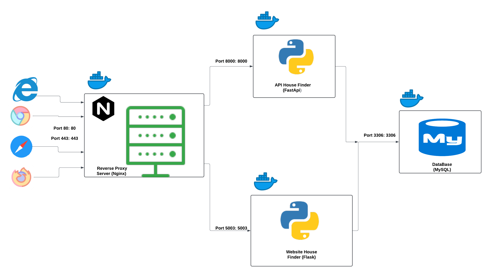

<div class="row ">
	<div class="col ">
		<h1  style="color:#C6AB7C; font-size: 80px; font-weight:bold;">HOUSE FINDER</h1>
	</div>
</div>

<h4 align="justify">In the Atlantico department - Colombia, there are many housing projects, of many types (VIS, VIP, NO VIS) where people of all classes can get their own home, but there are many options and I thought the following, why not create a website where people can search all options in one site instead to do it website by website? I decided start to create my first big project, using my knowlegde of HTML, CSS, Bootstrap, Python and two of its frameworks, FastApi and Flask and last, conect all this using docker containers.</h4> 

### Features of aplication

- Let view housing projects in Atlantico - Colombia, specifically in Puerto Colombia, Barranquilla and Soledad city, filter the search by construction company, location and city;
- User can register and login session, personalize their profiles and save their favorites projects on their accounts;
- got the option to change their passwords or get a new password in section forgot password where the new password is sent to their email;
- Each project page there is a comment section where each user can leave their opinions about the project;
- There is a section for developer where can read the documentation about the API, whatching the routes to make the requests, the differents responses and restrictions;
- Developers can generate their apikey to be allowed making requests;

### Dockerized  House Finder

This project is a Dockerized setup for the House Finder application, consisting of multiple services: a Flask web application, a FastAPI API, an NGINX reverse proxy, and a PostgreSQL database. The services are defined in a `docker-compose.yml` file for easy orchestration and deployment.

## Table of Contents
- [Project Structure](#project-structure)
- [Overview](#overview)
- [Prerequisites](#prerequisites)
- [Configuration](#configuration)
- [Services](#services)
  - [webapp_house_finder](#webapp_house_finder)
  - [api_house_finder](#api_house_finder)
  - [nginx](#nginx)
  - [postgresql_db](#postgresql_db)
- [Networks](#networks)
- [Volumes](#volumes)
- [Testing app services](#testing-app-services)
- [Running the Application](#running-the-application)
- [Diagram](#diagram)
- [Deployment on AWS EC2](#deployment-on-aws-ec2)

## Project Structure
```ini
Website-house-project-searching/
├── images/
│   ├── api/
│   └── profile/
├── postgresql_db/
├── nginx/
│   ├── Dockerfile
│   ├── nginx.conf
│   └── ssl/
│        ├── cert.pem
│        └── key.pem
├── api-house-finder/
│   ├── Dockerfile
│   ├── requirements.txt
│   ├── run.py
│   └── app/
│      ├── __init__.py
│      ├── database.py
│      ├── main.py
│      ├── models.py
│      ├── helper/
│      │     ├── download_img.py
│      │     └── normalize_text.py
│      ├── routers/	
│      │  ├── __init__.py
│      │  └── projects.py
│      ├── utils/	
│      │  ├── __init__.py
│      │  └── auth.py
│      └── test_project.py
│
├── webapp-house-finder/
│   ├── Dockerfile
│   ├── requirements.txt
│   ├── run.py
|   ├── config.py
│   └── app/
│      ├── __init__.py
│      ├── models.py
│      ├── auth/
│      │     ├── __init__.py
│      │     └── forms.py
|      ├── common/
│      │     ├── __init__.py
│      │     └── mail.py
│      ├── routers/	
│      │   ├── __init__.py
|      │   ├── api_documentation.py
|      │   ├── api.py
|      │   ├── index.py
|      │   ├── profile.py
|      │   ├── user.py
│      │   └── project.py
|      ├── templates/
|      ├── static/
│      ├── utils/	
│      │  ├── __init__.py
│      │  └── helpers.py
│      └── test/
|         ├── __init__.py
|         ├── conftest.py
|         ├── test_api_route.py
|         ├── test_profile_route.py
|         └── test_user_route.py
│   
├── docker-compose.png  
├── docker-compose.yml
└── .env

```

## Overview

This setup uses Docker Compose to manage the following services:

1. **Flask Web Application** (`webapp_house_finder`)
2. **FastAPI API** (`api_house_finder`)
3. **NGINX Reverse Proxy** (`nginx`)
4. **PostgreSQL Database** (`postgresql_db`)

All services are connected via a custom Docker network called `house_finder_web`.

## Prerequisites

- Docker installed on your machine
- Docker Compose installed on your machine
- Environment variables set in a `.env` file
- Graphviz installed and configured (for generating diagrams)


## Configuration

Create a `.env` file in the root directory of your project with the following variables:

```ini
# .env file
PRO_DB_URL=your_database_url
SECRET_APP_KEY=your_secret_key
FLASK_APP=your_flask_app
PRO_CONFIGURATION_SETUP=your_configuration_setup
APP_PASSWORD_EMAIL=your_app_password_email
ADMINISTER_EMAIL=your_admin_email
POSTGRES_PASSWORD=your_postgres_password
POSTGRES_USER=your_postgres_user
POSTGRES_DB=your_postgres_db
PRO_SERVER_NAME=host
```
## Services
### webapp_house_finder

- Description: This service runs the Flask web application.
- Build Context: `./webapp-house-finder`
- Dockerfile: `Dockerfile`
- Container Name: `flask_house_finder`
- Ports: `5003:5003`
- Volumes:
     - `./images/api:/app/app/static/images/img-projects`
     - `./images/profile:/app/app/static/images/img-profile`
- Environment Variables:
     - `DB_URL`
     - `SECRET_APP_KEY`
     - `FLASK_APP`
     - `CONFIGURATION_SETUP`
     - `APP_PASSWORD_EMAIL`
     - `ADMINISTER_EMAIL`
     - `DEBUG=False`
- Dependencies: `postgresql_db`
- Network: `house_finder_web`

The Dockerfile configuration is the next:
```init
FROM python:3.8-slim

RUN apt-get update && \
    apt-get install -y locales && \
    echo "en_US.UTF-8 UTF-8" > /etc/locale.gen && \
    locale-gen en_US.UTF-8

ENV LANG en_US.UTF-8
ENV LANGUAGE en_US:en
ENV LC_ALL en_US.UTF-8

WORKDIR /app

COPY requirements.txt ./

RUN pip install -r requirements.txt

RUN pip install pytest

COPY . .

EXPOSE 5003

CMD ["gunicorn", "run:app", "-w", "4", "--bind", "0.0.0.0:5003"]
```
  
### api_house_finder
- Description: This service runs the FastAPI application.
- Build Context: `./api-house-finder`
- Dockerfile: `Dockerfile`
- Container Name: `fastapi_house_finder`
- Ports: `8000:8000`
- Volumes:
     - `./images/api:/app/app/static/images/img-projects`
- Environment Variables:
     - `DB_URL`
     - `SECRET_APP_KEY`
- Dependencies: `postgresql_db`
- Network: `house_finder_web`
The Dockerfile configuration is the next:
```init
FROM python:3.11-slim

WORKDIR /app

COPY requirements.txt .

RUN pip install -r requirements.txt

RUN pip install pytest

COPY . .

CMD ["uvicorn", "main:app", "--host", "0.0.0.0", "--port", "8000"]
```

### nginx
- Description: This service runs the NGINX reverse proxy.
- Build Context: `./nginx`
- Ports: `80:80`
- Dependencies: `webapp_house_finder`, `api_house_finder`
- Network: `house_finder_web`
The Dockerfile configuration is the next:

```init
FROM nginx:latest

COPY nginx.conf /etc/nginx/nginx.conf

EXPOSE 80
```

### postgresql_db
- Description: This service runs the PostgreSQL database.
- Image: `postgres:12`
- Container Name: `postgresql_db`
- Ports: `5432:5432`
- Environment Variables:
     - `POSTGRES_PASSWORD`
     - `POSTGRES_USER`
     - `POSTGRES_DB`
- Volumes:
     - `./postgresql_data:/var/lib/postgresql/data`
- Network:
     - `house_finder_web`

## Networks
- house_finder_web: A custom network for connecting all the services.

## Volumes
- postgresql-data: Stores PostgreSQL data.
- images: Stores images used by the applications.

## Testing app services
In same `.env` file in the root directory of your project with the following test variables:
```ini
# .env file
TEST_CONFIGURATION_SETUP=TEST_CONFIG_FLASKAPP
TEST_DB_URL=SQLITE_URL_TESTING
TEST_APIKEY=TEST_CREDENTIALS_APIKEY
TEST_TOKEN=TEST_CREDENTIALS_TOKENSECRET
```
Docker compose configuration we add the next:

```ini
  test_fastapi:
    build:
      context: ./api-house-finder
      dockerfile: Dockerfile
    command: ["pytest"]
    environment:
      - DB_URL=${TEST_DB_URL}
      - TEST_APIKEY=${TEST_APIKEY}
      - TEST_TOKEN=${TEST_TOKEN}
    depends_on:
      - postgresql_db
    env_file:
      - .env

  test_flask:
    build:
      context: ./webapp-house-finder
      dockerfile: Dockerfile
    command: ["pytest", "app/tests/"]
    environment:
      - TEST_CONFIGURATION_SETUP=${TEST_CONFIGURATION_SETUP}
    env_file:
      - .env

```

## Running the Application

1. Ensure Docker and Docker Compose are installed.

2. Create a .env file in the root directory with the necessary environment variables.

3. Run the following command to build and start all services:
   
   `docker-compose up --build`

4. Access the services:
  - Flask Web Application: http://localhost:5003
  - FastAPI API: http://localhost:8000
  - NGINX Reverse Proxy: http://localhost:80

5. To stop the services, run:

   `docker-compose down`

## Diagram
- Below is a visual representation of the Docker Compose setup:



## Deployment on AWS EC2
### Prerequisites
- AWS Account
- EC2 instance (Free tier, Amazon Linux)
- GitHub repository with your project

### Steps
1. Update the package index on your EC2 instance:
  
  ```ini
  sudo yum update -y
  ```

2. Install Docker:

 ```ini
  sudo amazon-linux-extras install docker
  sudo service docker start
  sudo usermod -a -G docker ec2-user
  ```

3. Install Docker Compose:

 ```ini
  sudo curl -L "https://github.com/docker/compose/releases/download/1.29.2/docker-compose-$(uname -s)-$(uname -m)" -o /usr/local/bin/docker-compose
  sudo chmod +x /usr/local/bin/docker-compose
  docker-compose --version  # Verify installation
  ```

4. Ensure the Docker daemon is running and set to start on boot:

 ```ini
  sudo systemctl start docker
  sudo systemctl enable docker
  ```

5. Clone your GitHub repository:

 ```ini
  sudo git clone https://github.com/kaacuna20/Website-house-project-searching-.git
  ```

6. Transfer your Docker Compose file and `.env` file to the EC2 instance.
  - You can use `scp` or any preferred method to transfer these files.

7. Generate a self-signed SSL certificate (if you do not have a domain name):
  ```ini
  openssl req -x509 -nodes -newkey rsa:4096 -keyout key.pem -out cert.pem -days 365
  ```

8. Configure the nginx.conf with nano to enable HTTPS connection in port 443:
  ```ini
  cd /Website-house-project-searching-/nginx/
  sudo nano nginx.conf
```

```ini
  events { }

http {
        include /etc/nginx/mime.types;
    server {
        listen 80;
        server_name ${SERVER_NAME};

        location / {
            proxy_pass http://flask_house_finder:5003;
            proxy_set_header Host $host;
            proxy_set_header X-Real-IP $remote_addr;
            proxy_set_header X-Forwarded-For $proxy_add_x_forwarded_for;
            proxy_set_header X-Forwarded-Proto $scheme;
        }

        location /api/ {
            proxy_pass http://fastapi_house_finder:8000;
            proxy_set_header Host $host;
            proxy_set_header X-Real-IP $remote_addr;
            proxy_set_header X-Forwarded-For $proxy_add_x_forwarded_for;
            proxy_set_header X-Forwarded-Proto $scheme;
            proxy_set_header api_key $upstream_http_api_key;
        }

        location /docs {
            proxy_pass http://fastapi_house_finder:8000/docs;
            proxy_set_header Host $host;
            proxy_set_header X-Real-IP $remote_addr;
            proxy_set_header X-Forwarded-For $proxy_add_x_forwarded_for;
            proxy_set_header X-Forwarded-Proto $scheme;
        }

        location /openapi.json {
            proxy_pass http://fastapi_house_finder:8000/openapi.json;
            proxy_set_header Host $host;
            proxy_set_header X-Real-IP $remote_addr;
            proxy_set_header X-Forwarded-For $proxy_add_x_forwarded_for;
            proxy_set_header X-Forwarded-Proto $scheme;
        }
        location /redoc {
            proxy_pass http://fastapi_house_finder:8000/redoc;
            proxy_set_header Host $host;
            proxy_set_header X-Real-IP $remote_addr;
            proxy_set_header X-Forwarded-For $proxy_add_x_forwarded_for;
            proxy_set_header X-Forwarded-Proto $scheme;
        }
    }


        server{
                listen 443 ssl;
                server_name ${SERVER_NAME};

                ssl_certificate /etc/nginx/ssl/cert.pem;
                ssl_certificate_key /etc/nginx/ssl/key.pem;

                location / {
                        proxy_pass http://flask_house_finder:5003;
                        proxy_set_header Host $host;
                        proxy_set_header X-Real-IP $remote_addr;
                        proxy_set_header X-Forwarded-For $proxy_add_x_forwarded_for;
                        proxy_set_header X-Forwarded-Proto $scheme;
                      }

                location /api/ {
                        proxy_pass http://fastapi_house_finder:8000;
                        proxy_set_header Host $host;
                        proxy_set_header X-Real-IP $remote_addr;
                        proxy_set_header X-Forwarded-For $proxy_add_x_forwarded_for;
                        proxy_set_header X-Forwarded-Proto $scheme;
                        proxy_set_header api_key $upstream_http_api_key;                      
                        }

                location /openapi.json{
                        proxy_pass http://fastapi_house_finder:8000/openapi.json;
                        proxy_set_header Host $host;
                        proxy_set_header X-Real-IP $remote_addr;
                        proxy_set_header X-Forwarded-For $proxy_add_x_forwarded_for;
                        proxy_set_header X-Forwarded-Proto $scheme;
                        }

                location /redoc {
                        proxy_pass http://fastapi_house_finder:8000/redoc;
                        proxy_set_header Host $host;
                        proxy_set_header X-Real-IP $remote_addr;
                        proxy_set_header X-Forwarded-For $proxy_add_x_forwarded_for;
                        proxy_set_header X-Forwarded-Proto $scheme;
                      }

        }
}
  ```

9. Modify Dockerfile to copy the ssl certificates:
  ```ini
  sudo nano Dockerfile
```

```ini
  FROM nginx:latest

  RUN mkdir -p /etc/nginx/ssl

  COPY ./ssl/cert.pem /etc/nginx/ssl/cert.pem
  COPY ./ssl/key.pem /etc/nginx/ssl/key.pem


  RUN chmod 700 /etc/nginx/ssl/

  COPY nginx.conf /etc/nginx/nginx.conf

  EXPOSE 80 443
  ```

10. Navigate to your project directory and enable port 443 and volume of ssl certifications and nginx.conf:
  ```ini
  cd Website-house-project-searching-
  sudo nano docker-compose-yml
```

```ini
  version: "3.8"

  networks:
    house_finder_web:

  services:
            
    webapp_house_finder:
      container_name: flask_house_finder
      build:
        context: ./webapp-house-finder
        dockerfile: Dockerfile
      restart: always
      ports:
        - "5003:5003"
      volumes:
        - ./images/api:/app/app/static/images/img-projects
        - ./images/profile:/app/app/static/images/img-profile
      environment:
        - DB_URL=${PRO_DB_URL}
        - SECRET_APP_KEY=${SECRET_APP_KEY}
        - FLASK_APP=${FLASK_APP}
        - CONFIGURATION_SETUP=${PRO_CONFIGURATION_SETUP}
        - APP_PASSWORD_EMAIL=${APP_PASSWORD_EMAIL}
        - ADMINISTER_EMAIL=${ADMINISTER_EMAIL}
        - DEBUG=False
        - SERVER_NAME=${PRO_SERVER_NAME}
      depends_on:
        - postgresql_db
      env_file:
        - .env
      networks:
        - house_finder_web
    
    api_house_finder:
      container_name: fastapi_house_finder
      build:
        context: ./api-house-finder
        dockerfile: Dockerfile
      restart: always
      ports:
        - "8000:8000"
      volumes:
        - ./images/api:/app/app/static/images/img-projects
      environment:
        - DB_URL=${PRO_DB_URL}
        - SECRET_APP_KEY=${SECRET_APP_KEY}
      depends_on:
        - postgresql_db
      env_file:
        - .env
      networks:
        - house_finder_web

    nginx:
      build:
        context: ./nginx
      restart: always
      ports:
        - "80:80"
        - "443:443"
      volumes:
        - ./nginx/nginx.conf:/etc/nginx/nginx.conf:ro
        - ./nginx/ssl/cert.pem:/etc/nginx/ssl/cert.pem
        - ./nginx/ssl/key.pem:/etc/nginx/ssl/key.pem   
      depends_on:
        - webapp_house_finder
        - api_house_finder
      environment:
        - SERVER_NAME=${PRO_SERVER_NAME}
      networks:
        - house_finder_web


    postgresql_db:
      container_name: postgresql_db
      image: postgres:12
      restart: always
      ports:
        - "5432:5432"
      environment:
        - POSTGRES_PASSWORD=${POSTGRES_PASSWORD}
        - POSTGRES_USER=${POSTGRES_USER}
        - POSTGRES_DB=${POSTGRES_DB}
      volumes:
        - ./postgresql_data:/var/lib/postgresql/data 
      env_file:
        - .env
      networks:
        - house_finder_web

  volumes:
    postgresql-data:
    images:
  ```

11. Modify `.env` :
   - To change environment variable `PRO_SERVER_NAME`, if you don't have domain, use the `Public IPv4 DNS` or `Public IPv4 address` EC2 instance.

11. Run Docker Compose to start your application:
  ```ini
  sudo docker-compose up -d --build
  ```

### Verifying the Deployment
1. Check if the Docker containers are running:
  ```ini
   sudo docker ps
  ```

2. Access your application:
  - Open your browser and navigate to your EC2 instance's public IP address.

### Notes
  - Ensure your EC2 instance security groups allow traffic on the necessary ports (e.g., 80 and 443 for HTTP and HTTPS).

  - For a production environment, consider using a proper SSL certificate from a trusted Certificate Authority.
